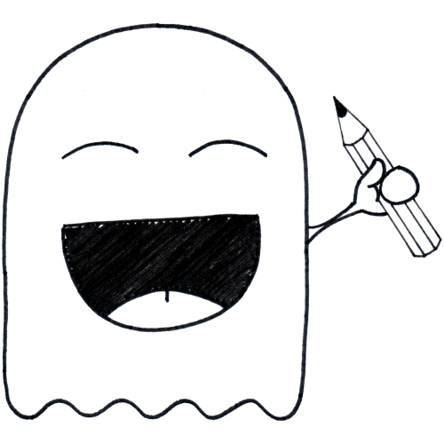

# Sketchy Boo

Sketchy Boo is a tool for converting scans of physical artwork into digitital assets.

_Note that this is frontend only. The backend is located at [https://github.com/BobbyDusk/sketchy-boo-backend](https://github.com/BobbyDusk/sketchy-boo-backend)_

## TODO

	- completely redraw crop box by dragging anywhere in the image
	- mask using path
	- add hover tooltips using 

	- auto crop, automatically detect if background is removed through whiteFilter or removeBackground 
	- if so, crop based on transparency, if not, crop based on white
	- Create feature that allows to scan paper with different square boxes, that then automatically detects square boxes,
	crops and removes background from whatever is inside and return all the images in a zipped file, maybe even have something
	with automatic naming of the file. For example, that you can just write the name in a different box, that it
	detect handwriting and then converts it the correct name. Also include the ability to add number, which represents the layer
	number and then automatically place all the layers in affinity in the correct order
	- have two modes: manual and automatic.
	manual let's you completely define everything yourself.
	automatic automatically finds the different objects, crops then and removes background
	maybe also have the ability to show the results one by one together with the ability to name
	it and tweak the settings
	- use processedImage as source for further processing
	- click image -> open modal with download button
	- hover over image -> 2 buttons: show modal and download
	- choice between actual size of image or real size of image. See css classes .actual-size and .contained-size

## License

This project is licensed under the AGPL-3.0 License - see the [LICENSE](LICENSE) file for details

## Copyright

Copyright (c) 2023, [Edge of Dusk](https://edgeofdusk.com)